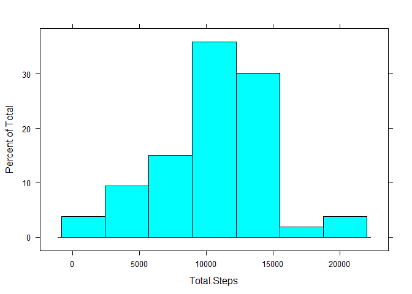
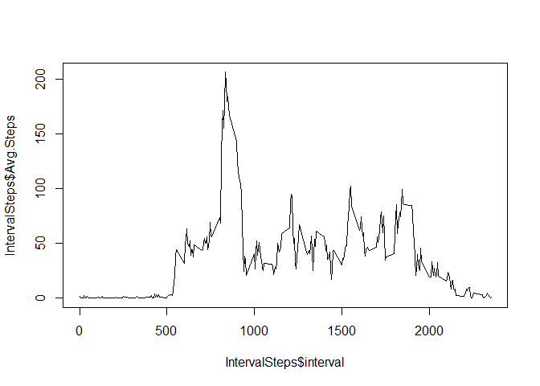
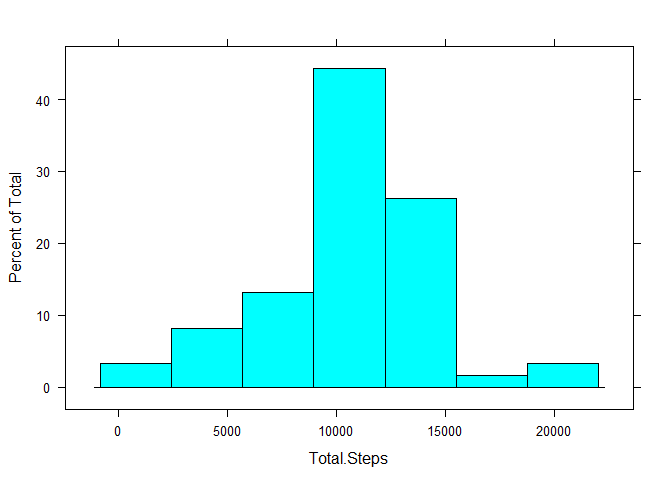
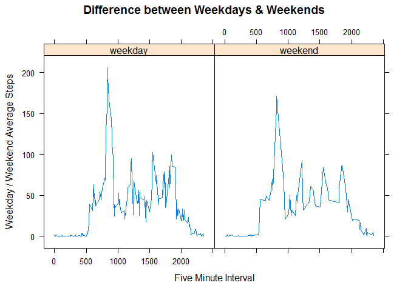

# Project1


## Loading and preprocessing the data

Importing the data from the saved location.


```r
data=read.csv("~/Data_Course/Reproducible_Research/Proj1/activity.csv")
summary(data)
```

```
##      steps                date          interval     
##  Min.   :  0.00   2012-10-01:  288   Min.   :   0.0  
##  1st Qu.:  0.00   2012-10-02:  288   1st Qu.: 588.8  
##  Median :  0.00   2012-10-03:  288   Median :1177.5  
##  Mean   : 37.38   2012-10-04:  288   Mean   :1177.5  
##  3rd Qu.: 12.00   2012-10-05:  288   3rd Qu.:1766.2  
##  Max.   :806.00   2012-10-06:  288   Max.   :2355.0  
##  NA's   :2304     (Other)   :15840
```

Pre-processing the data into suitable format for my analysis


```r
#install.packages(dplyr)
library(dplyr)
```

```
## Warning: package 'dplyr' was built under R version 3.2.3
```

```
## 
## Attaching package: 'dplyr'
```

```
## The following objects are masked from 'package:stats':
## 
##     filter, lag
```

```
## The following objects are masked from 'package:base':
## 
##     intersect, setdiff, setequal, union
```

```r
FitnessData=mutate(data,Day=as.POSIXlt(date)$yday, Month=as.POSIXlt(date)$mon+1, Year=as.POSIXlt(date)$year+1900, Wday=weekdays(as.POSIXlt(date))) #Adding few extra informational fields

head(FitnessData) #Look at a few rows
```

```
##   steps       date interval Day Month Year   Wday
## 1    NA 2012-10-01        0 274    10 2012 Monday
## 2    NA 2012-10-01        5 274    10 2012 Monday
## 3    NA 2012-10-01       10 274    10 2012 Monday
## 4    NA 2012-10-01       15 274    10 2012 Monday
## 5    NA 2012-10-01       20 274    10 2012 Monday
## 6    NA 2012-10-01       25 274    10 2012 Monday
```

## What is mean total number of steps taken per day?

Removing all instances where number of steps are NA. Note: Zeroes are not, and should not, be removed

```r
RemoveNA=filter(FitnessData,steps!='NA')
summary(RemoveNA$steps) #Make sure no missing values
```

```
##    Min. 1st Qu.  Median    Mean 3rd Qu.    Max. 
##    0.00    0.00    0.00   37.38   12.00  806.00
```

Calculating and printing the total number of steps per day


```r
by_date<-group_by(RemoveNA,date) #Grouping entries by Date
DaySteps<-summarise(by_date,Total.Steps=sum(steps)) #Calculating Total Steps per Day
print.data.frame(DaySteps) #Show the total steps for each day in the dataset
```

```
##          date Total.Steps
## 1  2012-10-02         126
## 2  2012-10-03       11352
## 3  2012-10-04       12116
## 4  2012-10-05       13294
## 5  2012-10-06       15420
## 6  2012-10-07       11015
## 7  2012-10-09       12811
## 8  2012-10-10        9900
## 9  2012-10-11       10304
## 10 2012-10-12       17382
## 11 2012-10-13       12426
## 12 2012-10-14       15098
## 13 2012-10-15       10139
## 14 2012-10-16       15084
## 15 2012-10-17       13452
## 16 2012-10-18       10056
## 17 2012-10-19       11829
## 18 2012-10-20       10395
## 19 2012-10-21        8821
## 20 2012-10-22       13460
## 21 2012-10-23        8918
## 22 2012-10-24        8355
## 23 2012-10-25        2492
## 24 2012-10-26        6778
## 25 2012-10-27       10119
## 26 2012-10-28       11458
## 27 2012-10-29        5018
## 28 2012-10-30        9819
## 29 2012-10-31       15414
## 30 2012-11-02       10600
## 31 2012-11-03       10571
## 32 2012-11-05       10439
## 33 2012-11-06        8334
## 34 2012-11-07       12883
## 35 2012-11-08        3219
## 36 2012-11-11       12608
## 37 2012-11-12       10765
## 38 2012-11-13        7336
## 39 2012-11-15          41
## 40 2012-11-16        5441
## 41 2012-11-17       14339
## 42 2012-11-18       15110
## 43 2012-11-19        8841
## 44 2012-11-20        4472
## 45 2012-11-21       12787
## 46 2012-11-22       20427
## 47 2012-11-23       21194
## 48 2012-11-24       14478
## 49 2012-11-25       11834
## 50 2012-11-26       11162
## 51 2012-11-27       13646
## 52 2012-11-28       10183
## 53 2012-11-29        7047
```


Histogram of total steps taken in a day. The histogram is concentrated in the middle with a thicker left tail.

```r
library(lattice)
```

```
## Warning: package 'lattice' was built under R version 3.2.3
```

```r
histogram(~Total.Steps,data=DaySteps)
```




Calculate and report the mean and median of the total number of steps taken per day

```r
mean(DaySteps$Total.Steps,na.rm=TRUE)
```

```
## [1] 10766.19
```

```r
median(DaySteps$Total.Steps,na.rm=TRUE)
```

```
## [1] 10765
```

## What is the average daily activity pattern?

Making a time series plot to show the average steps for each interval, across all days

```r
by_interval<-group_by(RemoveNA,interval) #Grouping entries by Interval
IntervalSteps<-summarise(by_interval,Avg.Steps=mean(steps)) #Calculating Average Steps for each interval
plot(x=IntervalSteps$interval,y=IntervalSteps$Avg.Steps,type="l")
```



Seeing which interval has the highest number of steps, on average

```r
head(arrange(IntervalSteps,desc(Avg.Steps)),1)
```

```
## Source: local data frame [1 x 2]
## 
##   interval Avg.Steps
##      (int)     (dbl)
## 1      835  206.1698
```
The interval 835 has the highest average across all days.


## Imputing missing values

Checking to see how many rows have incomplete data.

```r
sum(!complete.cases(data)) #Rows incomplete
```

```
## [1] 2304
```

```r
sum(!complete.cases(data))/nrow(data) #Percentage incomplete
```

```
## [1] 0.1311475
```
There are 2,304 rows incomplete (approximately 13%). 


Applying the interval average to all intervals with missing values. The new (complete) dataset is called m2.

```r
m2=merge(FitnessData,IntervalSteps,by.x="interval",all=TRUE) #adding column for interval mean to the pre-processed dataset
nrow(m2)==nrow(FitnessData) #Checking that no entries were lost
```

```
## [1] TRUE
```

```r
#Loop below assigns the average for each interval if the steps are 'NA'
for (i in 1:nrow(m2))
{
  if (m2[i,]$steps %in% NA)  m2[i,]$steps=m2[i,]$Avg.Steps
}
head(m2,7)
```

```
##   interval    steps       date Day Month Year     Wday Avg.Steps
## 1        0 1.716981 2012-10-01 274    10 2012   Monday  1.716981
## 2        0 0.000000 2012-11-23 327    11 2012   Friday  1.716981
## 3        0 0.000000 2012-10-28 301    10 2012   Sunday  1.716981
## 4        0 0.000000 2012-11-06 310    11 2012  Tuesday  1.716981
## 5        0 0.000000 2012-11-24 328    11 2012 Saturday  1.716981
## 6        0 0.000000 2012-11-15 319    11 2012 Thursday  1.716981
## 7        0 0.000000 2012-10-20 293    10 2012 Saturday  1.716981
```

Creating a histogram for total number of steps taken per day, after filling in the missing data using interval-based averages.

```r
by_date_Aug<-group_by(m2,date) #Grouping entries by Date
DaySteps_Aug<-summarise(by_date_Aug,Total.Steps=sum(steps)) #Calculating Total Steps per Day
#print.data.frame(DaySteps_Aug)


#library(lattice)
histogram(~Total.Steps,data=DaySteps_Aug)
```



Calculate and report the mean and median of the total number of steps taken per day after updating the NA's in the dataset

```r
mean(DaySteps_Aug$Total.Steps,na.rm=TRUE) #Updated Data Mean
```

```
## [1] 10766.19
```

```r
mean(DaySteps$Total.Steps,na.rm=TRUE) #Original Data Mean
```

```
## [1] 10766.19
```

```r
median(DaySteps_Aug$Total.Steps,na.rm=TRUE) #Updated Data Median
```

```
## [1] 10766.19
```

```r
median(DaySteps$Total.Steps,na.rm=TRUE) #Original Data Median
```

```
## [1] 10765
```

As can be seen from the data above, the mean and median for the original and the updated data set is very similar. This could be an indicatation that the method used to fill in the NA values is appropriate.  


## Are there differences in activity patterns between weekdays and weekends?

Defining weekdays and weekends

```r
weekday=c("Monday","Tuesday","Wednesday","Thursday","Friday")
weekend=c("Saturday","Sunday")

ActivityDay=mutate(m2,DayType=ifelse(Wday %in% weekday,"weekday",ifelse(Wday %in% weekend,"weekend","ERROR"))) #Creating variable to account for weekday/weekend
```


Panel plot containing time series plot of the 5-minute interval and the average number of steps taken, averaged across all weekday days or weekend days 

```r
library(lattice)
by_interval_wday<-group_by(ActivityDay,interval) #Grouping entries by Interval
IntervalSteps_wday<-summarise(by_interval_wday,Avg.Steps=mean(steps)) #Calculating Average Steps for each interval, across all days
xyplot(Avg.Steps~interval|ActivityDay$DayType,IntervalSteps_wday,type="l",panel = lattice.getOption("panel.xyplot"),xlab = "Five Minute Interval",ylab="Weekday / Weekend Average Steps", main="Difference between Weekdays & Weekends")
```


